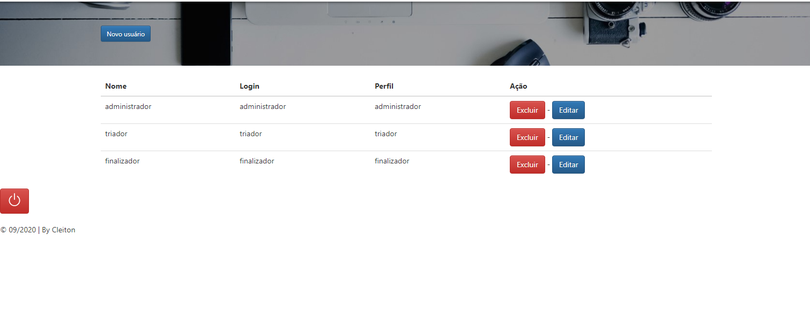

# Gerencia de Tarefas

Aplicativo híbrido (compatível com celular, tablet, computador e etc...) para gestão de Tarefas.

Funcionalidade: 

`TAREFAS`
- Incluir Tarefa.
- Editar Tarefas.
- Atribuir Tarefa.
- Incluir Parecer Sobre Determinada Tarefa

`Usuários`
- Incluir Usuário 
- Editar Usuário
- excluir Usuário
- definir perfil

Tipos de Perfil  de usuário: 

`- administrador`
.Incluir, excluir, atualizar e visualizar usuários.

**Usuário: administrador
**Senha: administrador 
Visão do usuário:

`- triador`
.Incluir e visualizar tarefa
.Atribuir usuários a realizar um parecer sobre um processo,

**Usuário: triador
**Senha: triador 
Visão do úsuario:

`- finalizador`
.Visualizar processos pendentes de parecer.
.Incluir o parecer sobre o processo.

**Usuário: finalizador
**Senha: finalizador 
Visão do usuário:

## Executando o projeto

### Pré-requisitos
* Node.JS

### Passo a passo

1 - Execute a linha de código a baixo para baixar a branch da aplicação: 
`git clone https://github.com/infortic/FrontAndProcessManegemet.git`

2 - Dentro da pasta do sistema execute: 
`npm install`
para baixar as dependências do Node.js

3 - Ainda dentro da pasta da aplicação execute: 
`npx serve`
se tudo ocorreu bem a aplicação estará disponível’ no seguinte link: `localhost:5000` 
ao acessar deverá chegar a tela de login

